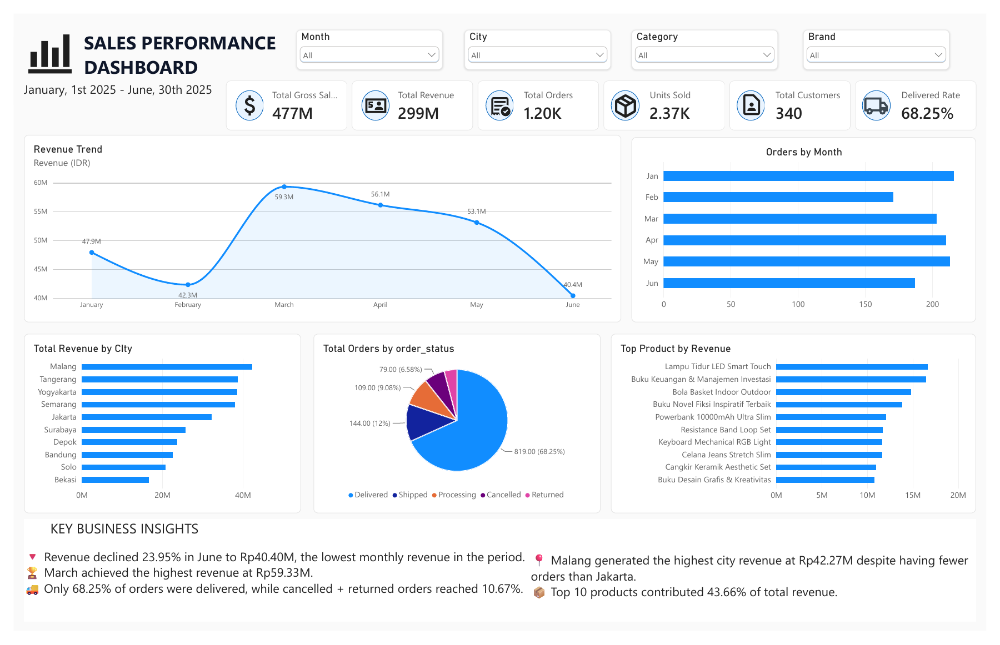

# E-Commerce Sales & Customer Performance Analysis

An e-commerce analytics portfolio project covering sales, product, and customer performance from January 1 to June 30, 2025. Data cleaning, preparation, and analysis were performed in Microsoft Excel using Power Query, formulas, and PivotTables. The dashboard was created with Microsoft Power BI.

## Dashboard Preview

[View the dashboard PDF](dashboard/power-bi-sales-dashboard.pdf)

The supplied dashboard is a static PDF export from Power BI. The editable Power BI project (`.pbix`) is not included, so slicers cannot be used in this repository preview.

## Project Objectives

- Evaluate sales trends, order volume, and delivery completion.
- Identify leading cities, categories, brands, and products.
- Explore customer activity, repeat purchases, and segment contributions.
- Translate findings into recommendations for further business investigation.

## Repository Contents

| Path | Description |
| --- | --- |
| [analysis/ecommerce-sales-customer-analysis.xlsx](analysis/ecommerce-sales-customer-analysis.xlsx) | Original Excel workbook with source tables, cleaning documentation, prepared data, formulas, and PivotTables. |
| [reports/ecommerce-analysis-report.pdf](reports/ecommerce-analysis-report.pdf) | Detailed analysis report in Indonesian, including findings, KPI definitions, and recommendations. |
| [dashboard/power-bi-sales-dashboard.pdf](dashboard/power-bi-sales-dashboard.pdf) | Static export of the dashboard created in Power BI. |
| [assets/power-bi-sales-dashboard.png](assets/power-bi-sales-dashboard.png) | Dashboard preview rendered from the supplied PDF. |

The three source files are preserved without content changes and renamed for consistent repository paths.

## Dataset

The data is included in the Excel workbook. An external dataset source or license was not specified in the supplied materials.

| Component | Coverage |
| --- | --- |
| Analysis period | January-June 2025 |
| Orders | 1,200 unique order IDs |
| Customer master | 350 customers |
| Active customers | 340 customers with at least one order |
| Product master | 60 products |
| Dimensions | 10 cities, 6 categories, 6 brands, and 5 order statuses |
| Clean dataset | 1,200 rows and 25 columns |

Each row in `clean` represents one unique order and one product. Product and customer attributes are joined using `product_id` and `customer_id`.

## Tools and Workflow

1. Microsoft Excel and Power Query: prepare and combine order, product, and customer tables, standardize data types, and handle missing attributes.
2. Excel formulas and validation: calculate and check transaction metrics. Observed formulas include IF, MIN, MAX, GETPIVOTDATA, and array formulas for customer lists and counts.
3. PivotTables: summarize sales by month, city, and order status, product performance, and customer behavior.
4. Power BI: present KPI cards, monthly revenue and orders, city contributions, order-status distribution, and leading products.
5. Written report: document findings, distinguish descriptive results from possible explanations, and propose follow-up analysis.

### Workbook Navigation

| Sheet | Purpose |
| --- | --- |
| `data_cleaning_&_preparation` | Cleaning and preparation notes |
| `raw` | Combined data before final cleaning |
| `clean` | Prepared analysis data with revenue calculation |
| `sales_performance` | Sales KPIs and aggregate analysis |
| `products_performance` | Product, category, and brand analysis |
| `customers_performance` | Customer rankings, segments, and order frequency |
| `orders` | Order source table |
| `customers` | Customer master |
| `products` | Product master |

### Data Preparation

- Preserve all 1,200 orders through cleaning.
- Fill eight missing courier values with `UNKNOWN`.
- Reconstruct eight missing promo codes as three `DISC10` and five `NONE`, based on the recorded discount amounts, as documented in the report.
- Add revenue for Delivered orders and validate gross sales, net sales, and total amount relationships.

## Key Metrics

| Metric | Result | Definition |
| --- | ---: | --- |
| Gross sales | IDR 476,935,000 | Quantity multiplied by unit price, all statuses |
| Net sales | IDR 443,464,750 | Gross sales less discounts, all statuses |
| Revenue | IDR 299,236,250 | Net sales from Delivered orders only, excluding shipping |
| Total orders | 1,200 | Unique orders across all statuses |
| Delivered orders | 819 | Orders with Delivered status |
| Delivered rate | 68.25% | Delivered orders divided by total orders |
| Total quantity | 2,368 | Ordered units across all statuses |
| Delivered quantity | 1,588 | Units from Delivered orders |
| Active customers | 340 | Customers with at least one order |
| AOV for Delivered orders | IDR 365,368 | Revenue divided by 819 Delivered orders, rounded |

The dashboard's `Units Sold` card includes quantity across all statuses. The workbook's AOV label uses revenue divided by all 1,200 orders (approximately IDR 249,364), which differs from AOV for Delivered orders above.

## Main Findings

- March generated the highest monthly revenue at IDR 59,330,250.
- June revenue fell 23.95% from May to IDR 40,399,750, alongside lower order volume, Delivered rate, and Delivered-order AOV.
- Malang contributed the most city revenue: IDR 42,270,250, or 14.13% of total revenue.
- Books and its associated brand Insight contributed IDR 80,540,000, or 26.92% of revenue.
- The top 10 products contributed 43.66% of revenue. The top 10 customers contributed 10.75%.
- Of 340 active customers, 300 placed more than one order, giving an observed repeat-customer rate of 88.24% across all order statuses.

Figures and interpretations are documented in the [analysis report](reports/ecommerce-analysis-report.pdf). Headline order, customer, gross-sales, and revenue totals were also checked against the workbook's saved `clean` values during repository preparation.

## Recommendations and Interpretation

- Investigate the June decline using order age, completion dates, and status history.
- Review the 253 Processing or Shipped orders separately from the 128 Cancelled or Returned orders. Open orders should not automatically be classified as permanent revenue loss.
- Monitor availability and fulfillment for high-contribution products.
- Compare customer segments using order frequency, Delivered-order value, and product mix before defining incentives.

The analysis is descriptive. The files do not establish causal drivers, profitability, cohort retention, or whether a customer placing one order is a first-time buyer. Statuses reflect the supplied snapshot, and monthly analysis follows order dates.

## How to Explore

1. Start with the dashboard PDF for an overview.
2. Read the report for definitions, detailed findings, and recommendations.
3. Download the Excel workbook and inspect the performance sheets and `clean` dataset.

The workbook contains saved results and query connections. Refreshing external sources may require configuring the original source paths. No standalone source CSVs or Power BI `.pbix` file were supplied.

## Author

Eko Damar Yogi
